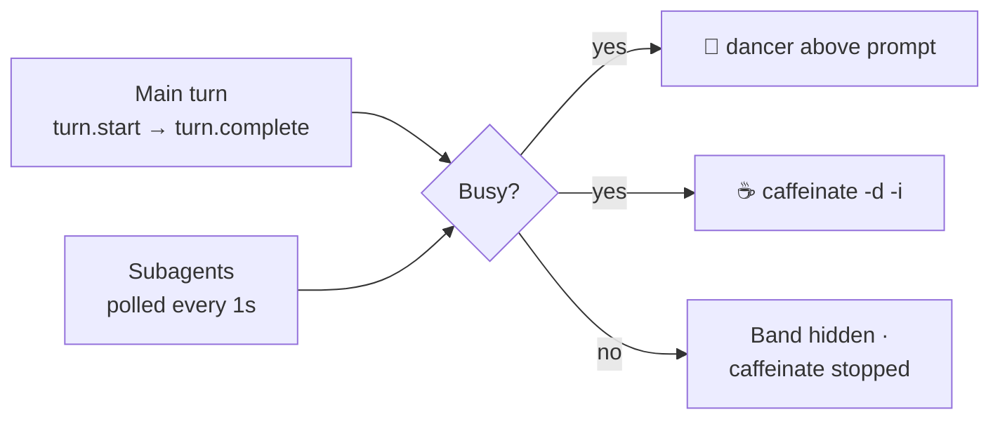

<div align="center">

# 💃 busy-dancer

**A Claude Code mod that dances while Claude works — and keeps your Mac awake until it's done.**

[](https://github.com/gwang-indoc/claude_run_status)
[](.claude-plugin/plugin.json)
[](#-requirements)
[](tests/busy.test.ts)

```
 ♪ CLAUDE IS WORKING                                   \O/
 🤖 2 subagents · ☕ screen kept awake                  / \
```

[Install](#-install) · [How it works](#%EF%B8%8F-how-it-works) · [Develop](#%EF%B8%8F-develop) · [FAQ](#-faq)

</div>

---

## ✨ Features

|     | What you get |
| :-: | --- |
| 💃 | **A little dancer above the prompt**, just two rows tall on a soft grape band, who dances back and forth whenever Claude is busy without eating your screen. With only one row to spare she rides a one-row bar instead |
| 🤖 | **Subagent aware** — counts running subagents, including background ones that outlive the main reply |
| ☕ | **No more locked screens** — runs `caffeinate -d -i` while busy so the display stays on and the Mac won't idle-sleep |
| 🧹 | **Cleans up after itself** — the dancer and `caffeinate` both stop within about a second of everything going idle |
| 🪶 | **Zero config** — one install line, nothing to set |

## 📦 Install

At the prompt of a Claude Code terminal session:

```
/plugin install busy-dancer --marketplace gwang-indoc/claude_run_status
```

Answer `y` to add the marketplace, then pick a scope — **user** scope loads it in every session.

<details>
<summary>Prefer the shell?</summary>

```sh
claude plugin marketplace add gwang-indoc/claude_run_status
claude plugin install busy-dancer@claude-run-status --scope user
```

Then run `/reload-plugins` in any open session, or start a new one.

</details>

## ⚙️ How it works



- **Main conversation** — busy from the moment a turn starts until it completes, whether answered, interrupted or errored.
- **Subagents** — the agent list is checked once a second; any agent that is `pending` or `running` counts.
- **Keep-awake** — `caffeinate -d -i` starts the moment anything is busy (`-d` keeps the display on, `-i` prevents idle sleep). It stops when everything goes idle, when the mod reloads, or when the session ends.

## 📋 Requirements

- **macOS** — `caffeinate` ships with it
- **Claude Code** with function-hook plugins (mods)

## 🛠️ Develop

```sh
claude --plugin-dir .       # run the mod from this folder
claude plugin validate .    # check the manifest and hooks
claude plugin test .        # run the tests
```

```
.
├── .claude-plugin/
│   ├── plugin.json         # plugin manifest
│   └── marketplace.json    # makes this repo installable
├── hooks/
│   ├── hooks.json
│   └── register.tsx        # all the logic
├── types/index.d.ts        # state contract
└── tests/busy.test.ts
```

To ship a change: bump `version` in `.claude-plugin/plugin.json`, push, then run `claude plugin update busy-dancer@claude-run-status` and `/reload-plugins`.

## 💬 FAQ

<details>
<summary><b>Claude Code crashed — is <code>caffeinate</code> still running?</b></summary>

It can be left behind after a hard crash. Stop it with:

```sh
pkill caffeinate
```

</details>

<details>
<summary><b>I see two dancers.</b></summary>

Two copies of the mod are loaded — usually a `--plugin-dir` dev copy plus the installed one. Start a fresh session with just one of them.

</details>

<details>
<summary><b>Does it work on Linux or Windows?</b></summary>

The dancer would, but keep-awake relies on macOS's `caffeinate`, so it's macOS only for now.

</details>

---

<div align="center">
<sub>Made for <a href="https://claude.com/claude-code">Claude Code</a> · 💃 keep dancing</sub>
</div>
